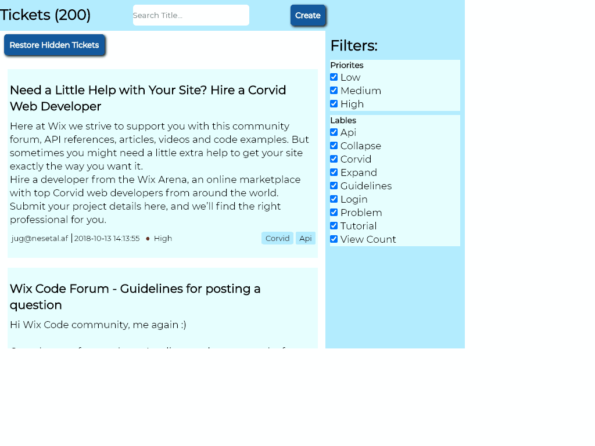

# Final 1/5 - Tickets Manager

## Backend Requirements

- [x] The Express app should be located in the path `server/app.js` and export the `app` object (`module.exports = app;`).
- [x] The server should run on port `8080` serve the react app on `http://localhost:8080/` and expose those API endpoints:
- [x] [GET] api/tickets - returns an array of tickets from saved in `server/data.json`. If called with query param `searchText` the API will filter only tickets that have a title including a case-insensitive version of the `searchText` param

## Requirements Client

- [x] The app title should be `Tickets Manager` with a custom favicon.
- [x] The app should load (from backend) and show all Tickets.
- [x] The Ticket component should have className `ticket`.
- [x] App ticket data (received from the server) might contain `label` property (an array of strings). add those tags to the UI using elements having the `label` class.
- [x] The app should have input with id `searchInput`. This input should request the server on `onChange` with relevant `searchText` param and update the list accordingly.
- [x] Add a hide button with className `hideTicketButton` that will hide the tickets from view. Add a counter of number of hiding tickets, this counter should have a `hideTicketsCounter` className.
- [x] Add a button to restore the hidden ticket list on click with the id `restoreHideTickets`.

## Before Submitting Requirements
- [x] Use ESLINT - run `npx eslint --init` in the backend folder & in the client.
Use a popular style guide - Airbnb

- [x] Deploy your app with Glitch. [my link](https://exciting-kind-memory.glitch.me/)

## Bonus
- [ ] [POST] api/tickets/:ticketId/done - Sets `done` property to `true` for the given ticketId
- [ ] [POST] api/tickets/:ticketId/undone - Sets `done` property to `false` for the given ticketId
- [x] New feature - add any cool functionality you want to the app
  1. tickets remain hidden after entering and deleting search query
  2. mark / unmark tickets as done
  3. add priority to every ticket
  4. filter tickets by priority / label
- [ ] Testing that feature - add a test to that new feature
- [x] Add an explanation for this new feature in your PR 
- [x] Visual creativity, use css to make this app look awesome 💅🏿

## Submitting
- [x] Before submitting, create a gif demoing your app in action: 
- [x] Open a PR from your work branch to the unchanged main branch.
- [x] Invite `Cyber4sPopo` as a [collaborator](https://docs.github.com/en/github/setting-up-and-managing-your-github-user-account/inviting-collaborators-to-a-personal-repository) to your repo 👮.
